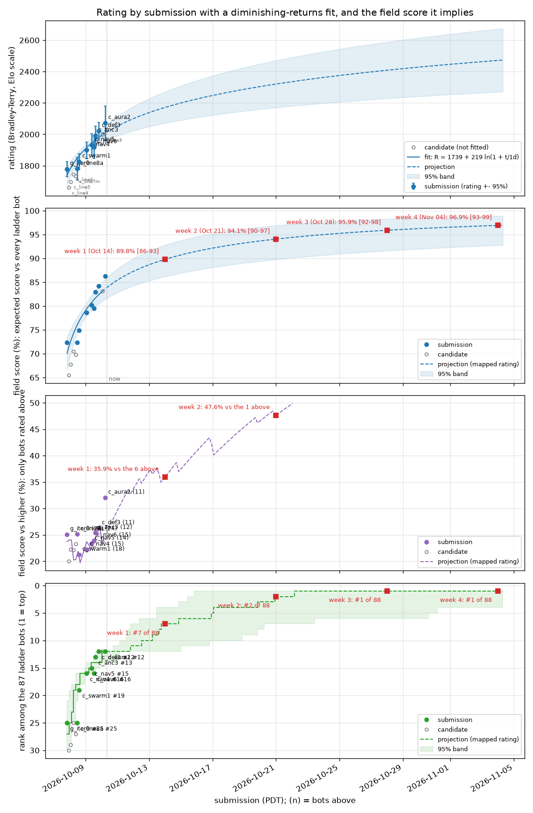

# battlecode23-vibe

A Battlecode 2023 ("Tempest") bot built by an autonomous agent under an evidence-driven training loop, as practice.
No official Battlecode infrastructure is used for evaluation: games run on our own VM, and the scrimmage ladder is a
private replica of the official judging stack (galaxy) that never contacts battlecode.org services.

Start with `TRAINING_ALGORITHM.md` (the loop), `RULES.md` (the game, engine-checked) and `HANDOFF.md` (current state).
All owner prompts are in `PROMPTS.md` (PDT).

The ladder replica runs galaxy's own backend and frontend behind a password-protected site with rankings and replays:
see `ACCESS.md`. Its code is in `tools/galaxy/` and its documentation in `docs/galaxy/` (the first, retired replica is in
`tools/replica/` and `docs/replica/`). Snapshots of the standings are committed as `progress/ladder.md` and
`progress/ladder.png`; our own rating history over every recorded game is in `progress/ELO.md` and `progress/elo.png`.

`progress/field-score-1w.png` / `progress/field-score-4w.png` (`tools/field_score.py`, owner PROMPTS 39-40, ported from
battlecode24-vibe): rating, field score (expected score against every ladder bot), score against the bots rated above,
and rank for every submitted build and rejected candidate, with the submissions fitted by R0 + a ln(1 + t/1d) and
projected with a 95% band to the ends of weeks 1-4. `progress/progress.png`: accepted builds only, in accept order.

