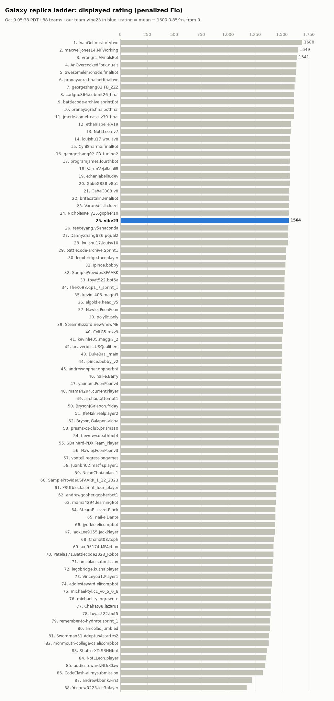

# Galaxy replica ladder

Snapshot of the Rankings page of our private galaxy replica (https://galaxy.136-86-167-127.sslip.io/bc23/rankings), taken Oct 9 05:38 PDT. Written by `tools/galaxy/snapshot.py`: regenerate it, do not edit it. The live site, with replays, is described in ACCESS.md.

**Rating is the galaxy replica's displayed rating**: siarnaq's penalized Elo, mean − 1500·0.85^n after n rated matches, so every team starts at 0 and climbs over its first ~20 ranked matches. It is not the Bradley-Terry fit of `progress/ELO.md`. 88 teams (88 with an accepted submission). Games W-L counts the games recorded in `progress/games.csv` from the replica (88 teams have some); our team is **vibe23**, whose builds appear there as `us:<package>`.

| # | Team | Rating | Games W-L | Submission |
|---:|---|---:|---|---|
| 1 | IvanGeffner.fortytwo | 1688.4 | 87-18 | accepted |
| 2 | maxwelljones14.MPWorking | 1649.4 | 66-18 | accepted |
| 3 | vrangr1.AFinalsBot | 1640.6 | 143-15 | accepted |
| 4 | AnOvercookedFork.quals | 1636.2 | 66-21 | accepted |
| 5 | awesomelemonade.finalBot | 1630.9 | 141-20 | accepted |
| 6 | pranayagra.finalbotfinaltwo | 1626.6 | 71-28 | accepted |
| 7 | georgezhang02.FB\_ZZZ | 1617.3 | 64-29 | accepted |
| 8 | carlguo866.submit26\_final | 1613.9 | 60-18 | accepted |
| 9 | battlecode-archive.sprintBot | 1612.4 | 64-20 | accepted |
| 10 | pranayagra.finalbotfinal | 1612.3 | 158-54 | accepted |
| 11 | jmerle.camel\_case\_v30\_final | 1611.5 | 148-49 | accepted |
| 12 | ethanlabelle.v19 | 1583.3 | 61-32 | accepted |
| 13 | NotLLeon.v7 | 1582.0 | 119-57 | accepted |
| 14 | louishu17.wouisv8 | 1575.9 | 73-47 | accepted |
| 15 | CyrilSharma.finalBot | 1575.2 | 58-38 | accepted |
| 16 | georgezhang02.CB\_tuning2 | 1574.3 | 119-60 | accepted |
| 17 | programjames.fourthbot | 1573.0 | 62-40 | accepted |
| 18 | VarunVejalla.ali8 | 1572.0 | 60-36 | accepted |
| 19 | ethanlabelle.dev | 1571.4 | 63-36 | accepted |
| 20 | GabeG888.v8o1 | 1571.2 | 54-24 | accepted |
| 21 | GabeG888.v8 | 1569.5 | 63-39 | accepted |
| 22 | britacatalin.FinalBot | 1566.7 | 109-64 | accepted |
| 23 | VarunVejalla.karel | 1566.5 | 70-50 | accepted |
| 24 | NicholasKelly15.gopher10 | 1563.9 | 54-30 | accepted |
| 25 | **vibe23** | 1563.5 | 454-778 | accepted |
| 26 | reeceyang.v5anaconda | 1561.2 | 91-94 | accepted |
| 27 | DannyZhang686.pqual2 | 1556.8 | 66-48 | accepted |
| 28 | louishu17.louisv10 | 1555.2 | 63-42 | accepted |
| 29 | battlecode-archive.Sprint1 | 1540.4 | 84-86 | accepted |
| 30 | legobridge.tacoplayer | 1536.5 | 70-59 | accepted |
| 31 | ipince.bobby | 1532.9 | 55-35 | accepted |
| 32 | SampleProvider.SPAARK | 1530.8 | 55-44 | accepted |
| 33 | toyat522.bot5a | 1525.7 | 58-50 | accepted |
| 34 | TheK098.qp1\_7\_sprint\_1 | 1524.1 | 56-46 | accepted |
| 35 | kevinli405.maggi3 | 1523.8 | 66-57 | accepted |
| 36 | elgoldie.head\_v5 | 1521.8 | 54-48 | accepted |
| 37 | Nawlej.PoonPoon | 1521.4 | 54-45 | accepted |
| 38 | polyllc.poly | 1520.3 | 54-48 | accepted |
| 39 | SteamBlizzard.newVnewME | 1512.0 | 64-62 | accepted |
| 40 | ColtG5.rexv9 | 1510.0 | 60-57 | accepted |
| 41 | kevinli405.maggi3\_2 | 1502.8 | 56-55 | accepted |
| 42 | beaverbois.USQualifiers | 1501.8 | 52-47 | accepted |
| 43 | DukeBas.\_main | 1500.0 | 50-46 | accepted |
| 44 | ipince.bobby\_v2 | 1498.9 | 55-56 | accepted |
| 45 | andrewgopher.gopherbot | 1496.3 | 64-68 | accepted |
| 46 | nail-e.Barry | 1495.4 | 50-46 | accepted |
| 47 | yaonam.PoonPoonv4 | 1494.5 | 75-137 | accepted |
| 48 | mama4294.currentPlayer | 1493.5 | 54-51 | accepted |
| 49 | aj-chau.attempt1 | 1491.2 | 49-47 | accepted |
| 50 | BrysonJGalapon.friday | 1490.9 | 59-58 | accepted |
| 51 | JfeMak.realplayer2 | 1489.1 | 51-51 | accepted |
| 52 | BrysonJGalapon.aloha | 1487.9 | 52-50 | accepted |
| 53 | prisms-cs-club.prisms10 | 1475.2 | 54-57 | accepted |
| 54 | bewuwy.deathbot4 | 1470.0 | 65-79 | accepted |
| 55 | SDainard-PDX.Team\_Player | 1469.5 | 44-46 | accepted |
| 56 | Nawlej.PoonPoonv3 | 1467.5 | 60-75 | accepted |
| 57 | vontell.regressiongames | 1467.0 | 60-69 | accepted |
| 58 | Juanbri02.matfisplayer1 | 1465.8 | 55-65 | accepted |
| 59 | NolanChai.nolan\_1 | 1465.3 | 48-60 | accepted |
| 60 | SampleProvider.SPAARK\_1\_12\_2023 | 1460.1 | 59-67 | accepted |
| 61 | PSUtblock.sprint\_four\_player | 1449.2 | 48-54 | accepted |
| 62 | andrewgopher.gopherbot1 | 1448.5 | 54-72 | accepted |
| 63 | mama4294.learningBot | 1443.1 | 49-71 | accepted |
| 64 | SteamBlizzard.Block | 1440.1 | 59-85 | accepted |
| 65 | nail-e.Dante | 1439.1 | 55-65 | accepted |
| 66 | jyorkio.elicompbot | 1438.6 | 49-59 | accepted |
| 67 | JackLee9355.jackPlayer | 1435.4 | 56-76 | accepted |
| 68 | Chahat08.toph | 1428.1 | 51-69 | accepted |
| 69 | ax-95174.MPAction | 1421.6 | 42-60 | accepted |
| 70 | Patela171.Battlecode2023\_Robot | 1421.1 | 55-77 | accepted |
| 71 | anicolao.submission | 1418.7 | 65-91 | accepted |
| 72 | legobridge.kushalplayer | 1414.5 | 38-61 | accepted |
| 73 | Vinceyou1.Player1 | 1406.6 | 46-68 | accepted |
| 74 | addiesteward.elicompbot | 1405.8 | 57-84 | accepted |
| 75 | michael-tyl.cc\_v0\_5\_0\_6 | 1401.4 | 62-97 | accepted |
| 76 | michael-tyl.hqrewrite | 1399.6 | 48-72 | accepted |
| 77 | Chahat08.lazarus | 1396.2 | 49-77 | accepted |
| 78 | toyat522.bot5 | 1395.1 | 46-74 | accepted |
| 79 | remember-to-hydrate.sprint\_1 | 1390.0 | 49-80 | accepted |
| 80 | anicolao.jumbled | 1388.6 | 67-104 | accepted |
| 81 | Swordman51.AdeptusAstartes2 | 1383.8 | 57-90 | accepted |
| 82 | monmouth-college-cs.elicompbot | 1377.2 | 50-82 | accepted |
| 83 | ShatterXD.SRNNbot | 1361.5 | 42-78 | accepted |
| 84 | NotLLeon.player | 1354.8 | 51-84 | accepted |
| 85 | addiesteward.NDeClaw | 1348.0 | 51-90 | accepted |
| 86 | CodeClash-ai.mysubmission | 1323.5 | 49-95 | accepted |
| 87 | andrewkbank.First | 1221.9 | 13-92 | accepted |
| 88 | Yooncw0223.lec3player | 1173.8 | 11-139 | accepted |

## Latest matches

| Match | Created | Player 0 | Score | Player 1 | Maps | Type | Status |
|---:|---|---|---|---|---|---|---|
| 1942 | Oct 9 05:37 PDT | NotLLeon.player | ?–? | CodeClash-ai.mysubmission | IslandHoppingTwo, Snowflake, Barcode | ranked | RUN |
| 1941 | Oct 9 05:36 PDT | georgezhang02.CB\_tuning2 | ?–? | VarunVejalla.ali8 | Spiral, Rainbow, Forest | ranked | RUN |
| 1940 | Oct 9 05:35 PDT | CodeClash-ai.mysubmission | ?–? | andrewkbank.First | Star, Movepls, Risk | ranked | RUN |
| 1939 | Oct 9 05:34 PDT | remember-to-hydrate.sprint\_1 | ?–? | monmouth-college-cs.elicompbot | Quiet, PairedProgramming, Heart | ranked | RUN |
| 1938 | Oct 9 05:33 PDT | andrewgopher.gopherbot1 | 1–2 | NolanChai.nolan\_1 | Rectangle, IslandHopping, TicTacToe | ranked | OK! |
| 1937 | Oct 9 05:33 PDT | britacatalin.FinalBot | ?–? | **vibe23** | Heart, SomethingFishy, Sneaky | ranked | RUN |
| 1936 | Oct 9 05:30 PDT | ipince.bobby\_v2 | ?–? | beaverbois.USQualifiers | Potions, Contraction, Resign | ranked | RUN |
| 1935 | Oct 9 05:29 PDT | CodeClash-ai.mysubmission | 2–1 | Yooncw0223.lec3player | Tightrope, Spiderweb, Crossword | ranked | OK! |
| 1934 | Oct 9 05:28 PDT | Vinceyou1.Player1 | 3–0 | monmouth-college-cs.elicompbot | Cave, SweetDreams, BowAndArrow | ranked | OK! |
| 1933 | Oct 9 05:28 PDT | **vibe23** | ?–? | louishu17.wouisv8 | Buggy, Target, Fractured | ranked | RUN |
| 1932 | Oct 9 05:27 PDT | SteamBlizzard.newVnewME | 0–3 | legobridge.tacoplayer | MassiveL, SoundWave, TreasureMap | ranked | OK! |
| 1931 | Oct 9 05:26 PDT | SampleProvider.SPAARK\_1\_12\_2023 | 1–2 | Nawlej.PoonPoonv3 | Snowflake, FishCake, Maze | ranked | OK! |
| 1930 | Oct 9 05:25 PDT | vontell.regressiongames | 3–0 | nail-e.Dante | Dreamy, AbsoluteW, Fractured | ranked | OK! |
| 1929 | Oct 9 05:24 PDT | Swordman51.AdeptusAstartes2 | 2–1 | monmouth-college-cs.elicompbot | IslandHopping, Forest, Target | ranked | OK! |
| 1928 | Oct 9 05:23 PDT | yaonam.PoonPoonv4 | 1–2 | DukeBas.\_main | BattleSuns, FourNations, USA | ranked | OK! |
| 1927 | Oct 9 05:22 PDT | **vibe23** | 0–3 | battlecode-archive.sprintBot | Lines, HideAndSeek, TicTacToe | ranked | OK! |
| 1926 | Oct 9 05:22 PDT | legobridge.tacoplayer | 1–2 | battlecode-archive.Sprint1 | FourNations, Jail, MoonPhases | ranked | OK! |
| 1925 | Oct 9 05:21 PDT | michael-tyl.hqrewrite | 0–3 | ax-95174.MPAction | SoundWave, SweetDreams, Piglets | ranked | OK! |
| 1924 | Oct 9 05:20 PDT | kevinli405.maggi3\_2 | 3–0 | Juanbri02.matfisplayer1 | Sun, Frog, Pillars | ranked | OK! |
| 1923 | Oct 9 05:18 PDT | michael-tyl.cc\_v0\_5\_0\_6 | 1–2 | addiesteward.elicompbot | TreasureMap, Rewind, Divergence | ranked | OK! |
